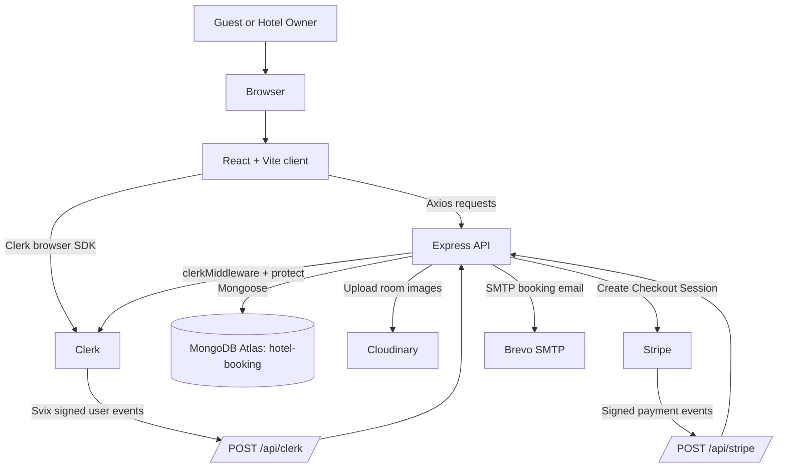
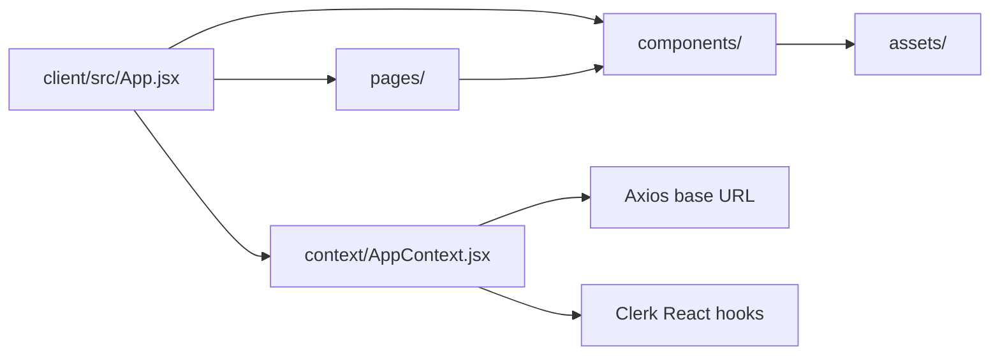
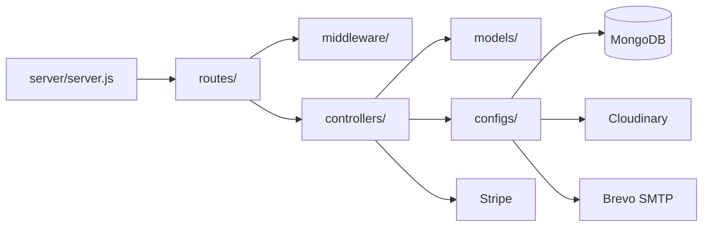
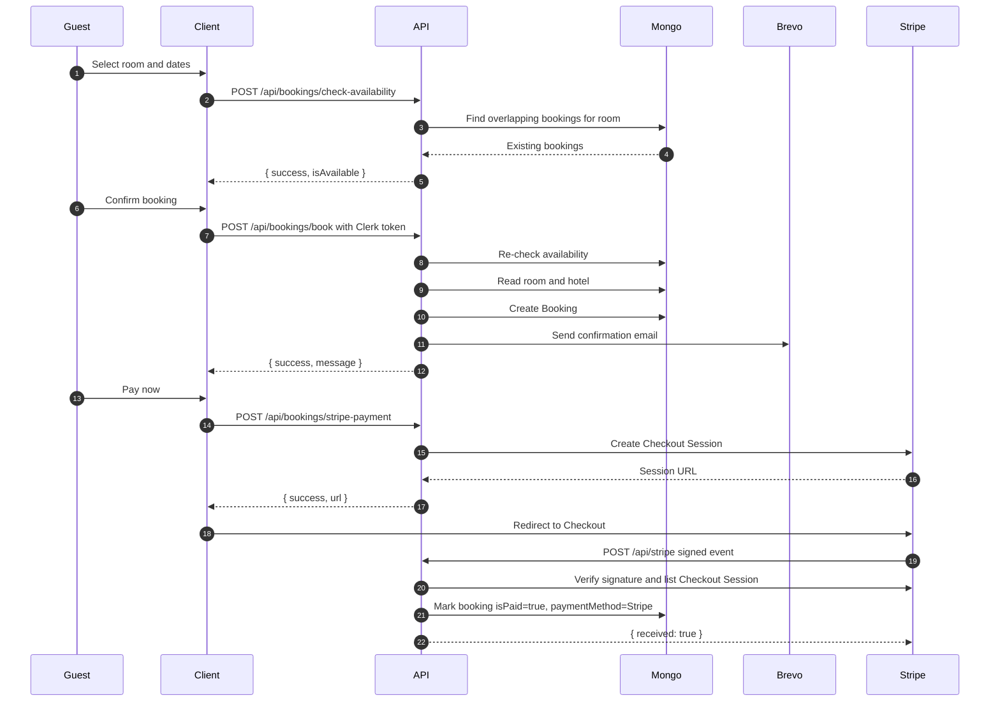
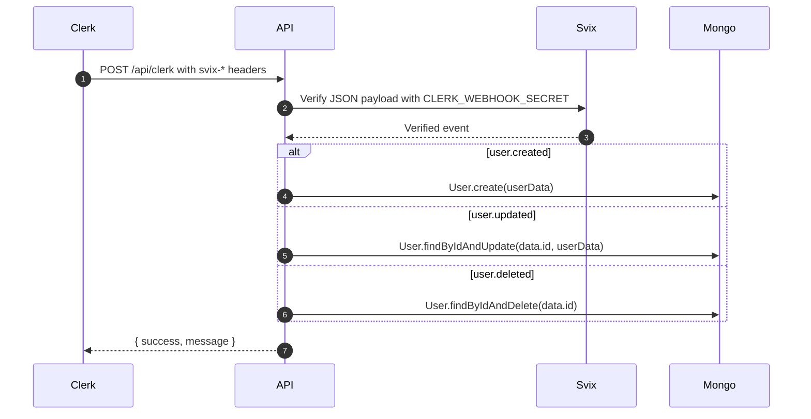
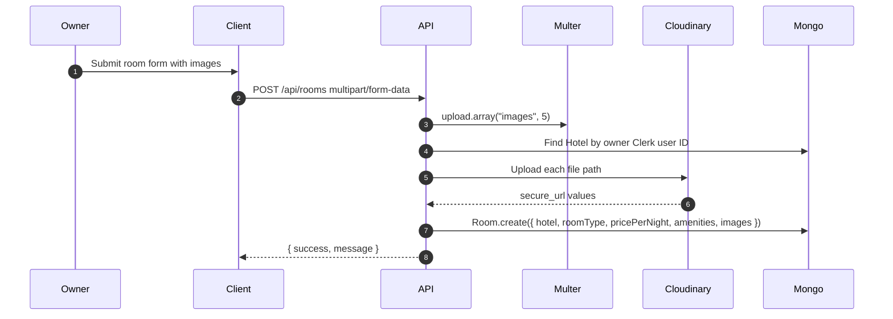
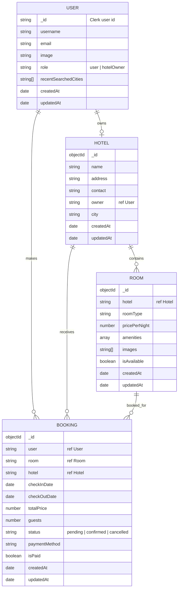

<!-- markdownlint-disable MD013 MD033 -->

# Architecture

NivaasHMS is a two-package JavaScript monorepo:

- `client/`: React 19, Vite 6, Tailwind 4, Clerk React, React Router.
- `server/`: Express 5, Mongoose 8, Clerk Express, Stripe, Cloudinary, Nodemailer/Brevo.

The server owns booking, room, hotel, user sync, payment, upload, and email side effects. The client owns routing, presentation, authenticated API calls, and shared UI state.

## System Context



## Module Responsibilities

### Client



| Area       | Path                                | Responsibility                                                                                             |
| ---------- | ----------------------------------- | ---------------------------------------------------------------------------------------------------------- |
| Entry      | `client/src/main.jsx`               | Creates React root and wraps the app with `ClerkProvider`, `BrowserRouter`, and `AppProvider`.             |
| Routes     | `client/src/App.jsx`                | Defines public, authenticated, loader, and owner routes.                                                   |
| State      | `client/src/context/AppContext.jsx` | Centralizes Clerk user/token access, axios base URL, room list, owner state, currency, and facility icons. |
| Pages      | `client/src/pages/`                 | Guest booking pages and owner dashboard pages.                                                             |
| Components | `client/src/components/`            | Shared UI for nav, cards, registration modal, owner layout, and visual sections.                           |
| Assets     | `client/src/assets/`                | Static images, icons, and asset exports.                                                                   |

### Server



| Area        | Path                                    | Responsibility                                                                                                 |
| ----------- | --------------------------------------- | -------------------------------------------------------------------------------------------------------------- |
| Entry       | `server/server.js`                      | Connects MongoDB/Cloudinary, configures CORS, webhooks, JSON parsing, Clerk middleware, routers, and listener. |
| Routes      | `server/routes/`                        | Maps HTTP paths to controller functions.                                                                       |
| Middleware  | `server/middleware/authMiddleware.js`   | Resolves Clerk `req.auth.userId` to a Mongo `User` and attaches `req.user`.                                    |
| Uploads     | `server/middleware/uploadMiddleware.js` | Uses Multer disk storage for multipart room image uploads.                                                     |
| Controllers | `server/controllers/`                   | Implements user, hotel, room, booking, Stripe webhook, and Clerk webhook behavior.                             |
| Models      | `server/models/`                        | Mongoose schemas for `User`, `Hotel`, `Room`, and `Booking`.                                                   |
| Configs     | `server/configs/`                       | MongoDB connection, Cloudinary config, and Brevo SMTP transporter.                                             |

## Critical Flows

### Booking to Payment



Implementation sources:

- Booking controller: [server/controllers/bookingController.js](server/controllers/bookingController.js)
- Stripe webhook: [server/controllers/stripeWebhooks.js](server/controllers/stripeWebhooks.js)
- Booking model: [server/models/Booking.js](server/models/Booking.js)

### User Sync



Implementation source: [server/controllers/clerkWebhooks.js](server/controllers/clerkWebhooks.js)

### Room Creation



Implementation sources:

- Room route: [server/routes/roomRoutes.js](server/routes/roomRoutes.js)
- Upload middleware: [server/middleware/uploadMiddleware.js](server/middleware/uploadMiddleware.js)
- Room controller: [server/controllers/roomController.js](server/controllers/roomController.js)

## Data Model



Schema sources:

- [server/models/User.js](server/models/User.js)
- [server/models/Hotel.js](server/models/Hotel.js)
- [server/models/Room.js](server/models/Room.js)
- [server/models/Booking.js](server/models/Booking.js)

## Request Pipeline

```mermaid
flowchart TD
  Incoming[HTTP request] --> CORS[cors()]
  CORS --> StripeCheck{Path is /api/stripe?}
  StripeCheck -->|yes| Raw[express.raw application/json]
  Raw --> StripeWebhook[stripeWebhooks]
  StripeCheck -->|no| JSON[express.json()]
  JSON --> ClerkMW[clerkMiddleware()]
  ClerkMW --> ClerkPath{Path is /api/clerk?}
  ClerkPath -->|yes| ClerkWebhook[clerkWebhooks]
  ClerkPath -->|no| Router[API router]
  Router --> Protect{Protected route?}
  Protect -->|yes| ProtectMW[protect middleware]
  ProtectMW --> Controller[controller]
  Protect -->|no| Controller
```

The Stripe webhook route is registered before `express.json()` so Stripe can verify the raw request body. Do not move it behind JSON parsing unless the webhook implementation changes accordingly.

## Known Limitations

- CORS is currently permissive through `app.use(cors())`.
- No automated tests exist yet.
- No server lint command exists yet.
- Public endpoints do not have rate limiting.
- Request bodies are trusted by controllers; schema validation is a future hardening task.
- Webhook handlers do not yet enforce idempotency for repeated provider deliveries.
- Booking conflict checks currently scan by date conditions without dedicated indexes.
- Some reference fields are typed as `String` even when they point at Mongo ObjectIds; future model cleanup should be planned carefully with migration testing.

## Future Evolution

- Add indexes for booking conflict checks and dashboard queries.
- Add controller tests with mocked provider clients and integration tests with a test MongoDB.
- Add server-side validation using a schema library.
- Add webhook event deduplication keyed by provider event IDs.
- Restrict CORS by environment.
- Move email and payment post-processing to a queue if traffic grows.
- Add observability: structured logs, request IDs, and provider webhook audit logs.
