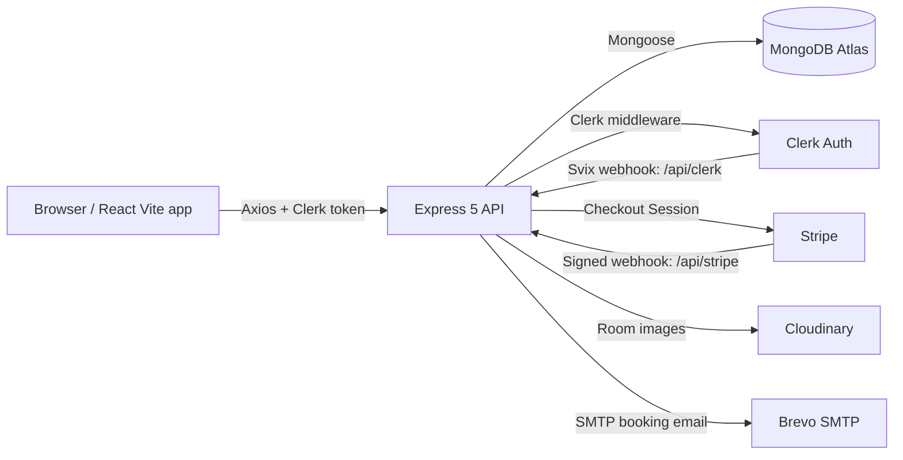

<!-- markdownlint-disable MD013 MD033 -->

# NivaasHMS

Full-stack hotel reservations platform with guest booking, owner dashboards, and Stripe-backed checkout.

[](#tech-stack)
[](#tech-stack)
[](#quick-start)
[](#tech-stack)
[](#tech-stack)
[](#tech-stack)
[](#tech-stack)
[](LICENSE)
[](#roadmap)

## Overview

NivaasHMS is a functional MVP for hotel reservations. Guests can browse available rooms, check date availability, create bookings, and pay through Stripe Checkout. Hotel owners can register a hotel, add rooms with Cloudinary-backed images, manage room availability, and view booking/revenue totals from an owner dashboard. The project is intentionally focused: a React/Vite client, an Express/MongoDB API, Clerk authentication, Stripe payments, Cloudinary image storage, and Brevo SMTP email.

## Problem Statement

Generic CMS and marketplace templates often hide the real booking workflow behind plugins. NivaasHMS models the core reservation path directly: identity, room inventory, date-range conflict checks, booking records, payment confirmation, and owner-facing inventory controls. That makes the codebase easier to reason about, easier to extend, and more useful as a portfolio-grade full-stack system.

## Live Demo / Screenshots

<!-- TODO: Add screenshots/GIFs of the guest booking and owner dashboard flows. -->

| Item             | Link / Status                                                 |
| ---------------- | ------------------------------------------------------------- |
| Live Frontend    | [nivaas-hms-ui.vercel.app](https://nivaas-hms-ui.vercel.app/) |
| API health check | [nivaas-hms.vercel.app](https://nivaas-hms.vercel.app/)       |

## Core Features

### Guest

- Browse public pages: `/`, `/rooms`, and `/rooms/:id`.
- View available rooms returned by `GET /api/rooms`.
- Check date availability with `POST /api/bookings/check-availability`.
- Create authenticated bookings with `POST /api/bookings/book`.
- Receive booking confirmation email through Brevo SMTP.
- View personal bookings at `/my-bookings` via `GET /api/bookings/user`.
- Start Stripe Checkout for a booking through `POST /api/bookings/stripe-payment`.

### Hotel Owner

- Register one hotel with `POST /api/hotels`.
- Become a `hotelOwner` after successful hotel registration.
- Add rooms at `/owner/add-room` with up to 5 uploaded images.
- Store room images on Cloudinary through the server upload flow.
- List owned rooms at `/owner/list-room`.
- Toggle room availability with `POST /api/rooms/toggle-availability`.
- View owner dashboard totals from `GET /api/bookings/hotel`.

### Platform

- Clerk session authentication on protected API routes.
- Clerk user sync webhook at `POST /api/clerk`, verified with Svix headers.
- Stripe webhook at `POST /api/stripe`, verified with Stripe signatures and `express.raw()`.
- MongoDB Atlas persistence for users, hotels, rooms, and bookings.
- Stateless Express API that can be scaled horizontally after shared operational concerns are handled.

## Tech Stack

| Category | Technology    | Version         | Purpose                                    |
| -------- | ------------- | --------------- | ------------------------------------------ |
| Frontend | React         | 19.1.0          | UI rendering and component model           |
| Frontend | Vite          | 6.2.5           | Local dev server and production build      |
| Frontend | Tailwind CSS  | 4.1.3           | Utility-first styling                      |
| Frontend | React Router  | 7.5.0           | Client-side routing                        |
| Frontend | Clerk React   | 5.26.1          | Client authentication                      |
| Frontend | Axios         | 1.8.4           | HTTP client with shared API base URL       |
| Backend  | Node.js       | 22+ recommended | JavaScript runtime                         |
| Backend  | Express       | 5.1.0           | HTTP API and webhook routing               |
| Backend  | Mongoose      | 8.13.2          | MongoDB models and queries                 |
| Backend  | Clerk Express | 1.4.2           | Server authentication middleware           |
| Backend  | Stripe        | 18.0.0          | Checkout Sessions and webhook verification |
| Backend  | Cloudinary    | 2.6.0           | Room image storage                         |
| Backend  | Multer        | 1.4.5-lts.2     | Multipart upload middleware                |
| Backend  | Nodemailer    | 6.10.0          | Brevo SMTP booking emails                  |
| Backend  | Svix          | 1.63.1          | Clerk webhook signature verification       |
| Database | MongoDB Atlas | Managed         | `hotel-booking` database                   |

## Architecture at a Glance



See [ARCHITECTURE.md](ARCHITECTURE.md) for the detailed module map, data flows, and ERD.

## Quick Start

### Prerequisites

- Node.js 22 or newer.
- npm.
- MongoDB Atlas cluster.
- Clerk, Stripe, Cloudinary, and Brevo accounts for full feature testing.
- Stripe CLI for local payment webhook testing.

### 1. Clone

```bash
git clone <your-fork-url>
cd NivaasHMS
```

### 2. Install dependencies

```bash
npm install

cd server
npm install

cd ../client
npm install
```

### 3. Configure environment

```bash
cd ../server
cp .env.example .env

cd ../client
cp .env.example .env.local
```

Fill both files using the tables below. For a full third-party setup walkthrough, see [docs/SETUP.md](docs/SETUP.md).

### 4. Run locally

```bash
# Terminal 1
cd server
npm run server

# Terminal 2
cd client
npm run dev
```

Default local URLs:

- Client: `http://localhost:5173`
- API: `http://localhost:3000`
- Health check: `http://localhost:3000/`

### 5. Test Stripe webhooks locally

```bash
stripe listen --forward-to localhost:3000/api/stripe
```

Copy the emitted `whsec_...` value into `server/.env` as `STRIPE_WEBHOOK_SECRET`, then restart the API.

## Environment Variables

### Server (`server/.env`)

| Variable                 | Required | Source                                                                             | Purpose                                                                        |
| ------------------------ | -------- | ---------------------------------------------------------------------------------- | ------------------------------------------------------------------------------ |
| `MONGODB_URI`            | Yes      | [server/configs/db.js](server/configs/db.js)                                       | MongoDB Atlas URI; app appends `/hotel-booking`.                               |
| `CLOUDINARY_CLOUD_NAME`  | Yes      | [server/configs/cloudinary.js](server/configs/cloudinary.js)                       | Cloudinary account name.                                                       |
| `CLOUDINARY_API_KEY`     | Yes      | [server/configs/cloudinary.js](server/configs/cloudinary.js)                       | Cloudinary API key.                                                            |
| `CLOUDINARY_API_SECRET`  | Yes      | [server/configs/cloudinary.js](server/configs/cloudinary.js)                       | Cloudinary API secret.                                                         |
| `CLERK_PUBLISHABLE_KEY`  | Yes      | [server/server.js](server/server.js)                                               | Clerk server SDK environment.                                                  |
| `CLERK_SECRET_KEY`       | Yes      | [server/server.js](server/server.js)                                               | Clerk server SDK environment.                                                  |
| `CLERK_WEBHOOK_SECRET`   | Yes      | [server/controllers/clerkWebhooks.js](server/controllers/clerkWebhooks.js)         | Svix verification for `POST /api/clerk`.                                       |
| `STRIPE_PUBLISHABLE_KEY` | No       | [server/.env.example](server/.env.example)                                         | Included for Stripe key parity; current server code does not read it directly. |
| `STRIPE_SECRET_KEY`      | Yes      | [server/controllers/bookingController.js](server/controllers/bookingController.js) | Creates Checkout Sessions.                                                     |
| `STRIPE_WEBHOOK_SECRET`  | Yes      | [server/controllers/stripeWebhooks.js](server/controllers/stripeWebhooks.js)       | Verifies `POST /api/stripe`.                                                   |
| `SENDER_EMAIL`           | Yes      | [server/controllers/bookingController.js](server/controllers/bookingController.js) | Sender for booking confirmation emails.                                        |
| `SMTP_USER`              | Yes      | [server/configs/nodemailer.js](server/configs/nodemailer.js)                       | Brevo SMTP login.                                                              |
| `SMTP_PASS`              | Yes      | [server/configs/nodemailer.js](server/configs/nodemailer.js)                       | Brevo SMTP password.                                                           |
| `CURRENCY`               | No       | [server/controllers/bookingController.js](server/controllers/bookingController.js) | Email currency symbol; defaults to `$`.                                        |
| `PORT`                   | No       | [server/server.js](server/server.js)                                               | API port; defaults to `3000`.                                                  |

### Client (`client/.env.local`)

| Variable                     | Required | Source                                                                 | Purpose                                       |
| ---------------------------- | -------- | ---------------------------------------------------------------------- | --------------------------------------------- |
| `VITE_BACKEND_URL`           | Yes      | [client/src/context/AppContext.jsx](client/src/context/AppContext.jsx) | Axios API base URL.                           |
| `VITE_CLERK_PUBLISHABLE_KEY` | Yes      | [client/src/main.jsx](client/src/main.jsx)                             | Clerk browser SDK key; app throws if missing. |
| `VITE_CURRENCY`              | No       | [client/src/context/AppContext.jsx](client/src/context/AppContext.jsx) | UI currency symbol; defaults to `$`.          |

## Available Scripts

### Root tooling

| Command                | Purpose                                                              |
| ---------------------- | -------------------------------------------------------------------- |
| `npm run lint`         | Run strict ESLint over client and server with `--max-warnings=0`.    |
| `npm run lint:fix`     | Auto-fix ESLint issues where safe.                                   |
| `npm run format`       | Format the repo with Prettier.                                       |
| `npm run format:check` | Verify Prettier formatting without writing files.                    |
| `npm run typecheck`    | Run practical JS checks: server syntax plus client production build. |
| `npm run build`        | Build the client package.                                            |
| `npm run docs:lint`    | Lint Markdown docs.                                                  |
| `npm run docs:links`   | Check key documentation links.                                       |
| `npm run check`        | Run the full local/CI quality gate.                                  |

### `server/`

| Command             | Purpose                                           |
| ------------------- | ------------------------------------------------- |
| `npm run server`    | Start the API with nodemon for local development. |
| `npm start`         | Start the API with Node.                          |
| `npm run lint`      | Delegate to the root server lint gate.            |
| `npm run typecheck` | Delegate to the root server syntax check.         |
| `npm run check`     | Run server lint and syntax checks.                |

### `client/`

| Command            | Purpose                                       |
| ------------------ | --------------------------------------------- |
| `npm run dev`      | Start the Vite dev server.                    |
| `npm run build`    | Build the production client bundle.           |
| `npm run lint`     | Delegate to the root client lint gate.        |
| `npm run lint:fix` | Delegate to the root ESLint auto-fix command. |
| `npm run format`   | Delegate to root Prettier formatting.         |
| `npm run check`    | Run the full root quality gate.               |
| `npm run preview`  | Preview the production build locally.         |

## Quality Tooling

The repository uses a root tooling layer so both packages follow the same standards without converting to npm workspaces.

| Tool               | Purpose                                                                                 |
| ------------------ | --------------------------------------------------------------------------------------- |
| Prettier           | Enforces consistent formatting across JavaScript, Markdown, JSON, CSS, HTML, and YAML.  |
| ESLint flat config | Applies React/Vite rules to the client and Node/Express rules to the server.            |
| EditorConfig       | Keeps editor indentation, line endings, charset, and final newline behavior consistent. |
| Husky              | Installs Git hooks for local quality gates.                                             |
| lint-staged        | Formats and fixes only staged files before commit.                                      |
| commitlint         | Enforces Conventional Commit messages.                                                  |
| GitHub Actions     | Runs `npm run check` for pull requests and pushes to `main`/`master`.                   |

Hook behavior:

- Pre-commit: `lint-staged`
- Commit message: `commitlint`
- Pre-push: `npm run check`

## Project Structure

```text
NivaasHMS/
|-- client/
|   |-- public/                 # Static assets served by Vite
|   |-- src/
|   |   |-- assets/             # Local images and SVG icons
|   |   |-- components/         # Shared guest and owner UI
|   |   |-- context/            # AppContext: auth, axios, room state
|   |   |-- pages/              # Public and authenticated pages
|   |   |-- App.jsx             # Client route definitions
|   |   `-- main.jsx            # ClerkProvider and React root
|   |-- .env.example            # Client env template
|   |-- package.json
|   `-- vite.config.js
|-- server/
|   |-- configs/                # MongoDB, Cloudinary, Nodemailer
|   |-- controllers/            # Route handlers and webhook handlers
|   |-- middleware/             # Clerk auth and Multer upload middleware
|   |-- models/                 # User, Hotel, Room, Booking schemas
|   |-- routes/                 # Express routers
|   |-- .env.example            # Server env template
|   |-- package.json
|   `-- server.js               # Express entrypoint
|-- docs/
|   |-- API.md                  # Full endpoint reference
|   `-- SETUP.md                # Service-by-service setup guide
|-- .github/
|   |-- ISSUE_TEMPLATE/
|   |-- workflows/ci.yml
|   `-- PULL_REQUEST_TEMPLATE.md
|-- .editorconfig
|-- .gitattributes
|-- .husky/
|-- .prettierrc.json
|-- ARCHITECTURE.md
|-- CLAUDE.md
|-- CODE_OF_CONDUCT.md
|-- CONTRIBUTING.md
|-- eslint.config.js
|-- LICENSE
|-- package.json              # Root quality tooling and scripts
|-- README.md
`-- SECURITY.md
```

## API Reference

Base URL: `VITE_BACKEND_URL`, commonly `http://localhost:3000` in development.
Protected routes expect `Authorization: Bearer <Clerk session token>`.

| Method | Path                               | Auth              | Purpose                                           |
| ------ | ---------------------------------- | ----------------- | ------------------------------------------------- |
| `GET`  | `/`                                | Public            | Health check.                                     |
| `GET`  | `/api/user`                        | Clerk             | Fetch user role and recent searched cities.       |
| `POST` | `/api/user/store-recent-search`    | Clerk             | Store up to 3 recent searched cities.             |
| `POST` | `/api/hotels`                      | Clerk             | Register one hotel and promote the user to owner. |
| `POST` | `/api/rooms`                       | Clerk + multipart | Create a room with up to 5 Cloudinary images.     |
| `GET`  | `/api/rooms`                       | Public            | List available rooms.                             |
| `GET`  | `/api/rooms/owner`                 | Clerk             | List rooms for the current owner's hotel.         |
| `POST` | `/api/rooms/toggle-availability`   | Clerk             | Toggle a room's `isAvailable` flag.               |
| `POST` | `/api/bookings/check-availability` | Public            | Check date-range availability.                    |
| `POST` | `/api/bookings/book`               | Clerk             | Create a booking and send confirmation email.     |
| `GET`  | `/api/bookings/user`               | Clerk             | List current user's bookings.                     |
| `GET`  | `/api/bookings/hotel`              | Clerk             | Owner dashboard bookings and totals.              |
| `POST` | `/api/bookings/stripe-payment`     | Clerk             | Create a Stripe Checkout Session.                 |
| `POST` | `/api/stripe`                      | Stripe signature  | Mark booking paid after payment success.          |
| `POST` | `/api/clerk`                       | Svix signature    | Sync Clerk user create/update/delete events.      |

See [docs/API.md](docs/API.md) for request bodies, response shapes, error cases, and curl examples.

## Deployment

### Client: Vercel or Netlify

- Build command: `npm run build`.
- Output directory: `dist`.
- Set `VITE_BACKEND_URL` to the deployed API origin.
- Set `VITE_CLERK_PUBLISHABLE_KEY` and `VITE_CURRENCY`.
- Configure SPA fallback rewrites if the host does not auto-detect Vite.

### Server: Render, Railway, Fly.io, or similar

- Start command: `npm start`.
- Set all values from [server/.env.example](server/.env.example).
- Ensure MongoDB Atlas network access allows the deployed server.
- Use a persistent production `MONGODB_URI`; do not point production at local data.

### Webhook gotchas

- Stripe endpoint path: `https://<api-domain>/api/stripe`.
- Clerk endpoint path: `https://<api-domain>/api/clerk`.
- Stripe must receive the raw body for `/api/stripe`; keep the current middleware order in [server/server.js](server/server.js).
- Clerk webhook verification uses Svix headers and `CLERK_WEBHOOK_SECRET`.
- After changing webhook secrets, restart the API process.

### CORS

The API currently uses `cors()` without an origin allowlist. That is convenient for local development but should be locked down before public production use. This is documented as a known hardening gap and intentionally not changed in this scaffold.

## Scalability Considerations

- The Express server is stateless; with shared MongoDB and externalized uploads/email/payments, it can scale horizontally behind a load balancer.
- Add MongoDB indexes for booking conflict checks, likely on `{ room, checkInDate, checkOutDate }`, and owner dashboard queries on `{ hotel, createdAt }`.
- Add webhook idempotency so repeated Stripe or Clerk deliveries cannot apply duplicate side effects.
- Restrict CORS origins to known client domains before production launch.
- Add rate limiting and request validation on public booking/search endpoints.
- Move payment and email side effects toward background jobs if throughput grows.

## Roadmap

- Add automated tests: unit tests for controllers and integration tests for booking/payment flows.
- Add automated test jobs to CI once Vitest/Jest coverage exists.
- Add rate limiting and request body validation.
- Move search and filtering logic to server-backed query parameters.
- Add customer reviews after bookings are complete.
- Add internationalization and multi-locale formatting.
- Add PWA/offline affordances for the client shell.

## Help Wanted

- A fresh onboarding pass is needed: an outside reviewer should confirm that README plus [docs/SETUP.md](docs/SETUP.md) is enough to go from clone to local booking flow.
- Good first issues are listed in [CONTRIBUTING.md](CONTRIBUTING.md).

## Contributing

Contributions are welcome. Start with [CONTRIBUTING.md](CONTRIBUTING.md), follow the [Code of Conduct](CODE_OF_CONDUCT.md), and keep feature claims grounded in code that exists.

## Security

Please report vulnerabilities privately using [SECURITY.md](SECURITY.md). Known security boundaries are documented there so contributors can prioritize hardening work.

## License

NivaasHMS is released under the [MIT License](LICENSE).

## Acknowledgements / Contact

Built by Aaditya Gunjal as a full-stack hotel booking MVP. Replace this block with the maintainer's preferred portfolio, GitHub, and contact links before public launch.
